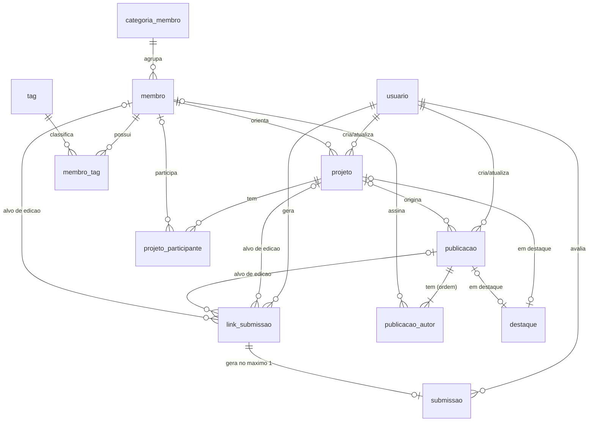

# Banco de dados — modelo físico v2

SGBD: **SQLite 3** (≥ 3.38, com JSON1). Script oficial: [`database/schema.sql`](../database/schema.sql).
A versão do schema fica em `PRAGMA user_version` (atual: **2**).

## 1. O que foi corrigido em relação ao banco anterior (v1)

O banco v1 era uma cópia direta do antigo `site_content.json`, e a aplicação regravava as tabelas inteiras a cada
alteração (`DELETE FROM ...` seguido de reinserção de tudo). Problemas encontrados e como foram resolvidos:

| Problema no v1 | Regra violada | Solução no v2 |
|---|---|---|
| `projeto.estudantes` = `"Davi Campos Parente e Ivanilson Paixao Cirqueira"` | 1FN: atributo multivalorado | Tabela `projeto_participante` (N:N com `membro`) |
| `publicacao.participantes` = `"PEREIRA, D.; LIMA, J.; ..."` | 1FN | Tabela `publicacao_autor`, com a ordem de autoria |
| `membro.tags` = `'["IA", "Web"]'` (JSON em texto) | 1FN | Tabelas `tag` e `membro_tag` |
| `projeto.badge` = `"PIBIC 2025/2026"` (modalidade + período num campo só) | Atomicidade | `modalidade` (enum) + `ano_inicio` / `ano_fim`; o rótulo é derivado na aplicação |
| `projeto.orientador` em texto livre | Integridade referencial | `orientador_id` → `membro(id)` |
| Destaque da home como `highlight_type` + `highlight_item_id` (texto) em `configuracao` | Integridade referencial (FK polimórfica) | Tabela `destaque`, de linha única, com duas FKs e `CHECK` de exclusividade |
| IDs em texto (`"project-9f3a..."`) | Chave substituta estável | `INTEGER PRIMARY KEY AUTOINCREMENT` |
| String vazia `''` para "sem valor" | Semântica de ausência | `NULL` |
| Nenhum `CHECK`: ano `"abc"`, Lattes `"admin123"`, link sem protocolo | Integridade de domínio | `CHECK` em todos os atributos categorizados e formatados |
| Links e submissões em arquivos JSON (perdidos a cada deploy) | Persistência e consistência | Tabelas `link_submissao` e `submissao` |
| Nenhum registro de quem alterou | Auditoria | Tabela `usuario` + `criado_por` / `atualizado_por` |

> **Diferenças em relação ao modelo descrito no relatório da Sprint 2:**
> - A autenticação é feita pelo Firebase (login Google), então `usuario` não tem `senha_hash`. A tabela registra os
>   administradores para auditoria e permite desativar um acesso (`ativo = 0`).
> - O participante de projeto pode ser um membro cadastrado **ou** uma pessoa externa (há ex-alunos que não estão na página
>   Equipe). O mesmo vale para os autores de publicações, que guardam o nome como aparece na citação.
> - Foram acrescentadas as tabelas `tag`, `membro_tag`, `slider_imagem`, `parceiro`, `destaque`, `configuracao`,
>   `link_submissao` e `submissao`.

## 2. Diagrama entidade-relacionamento

Tabelas independentes: `contato`, `mensagem_contato`, `slider_imagem`, `parceiro` e `configuracao`.

## 3. Dicionário de dados

Convenções: nomes em `snake_case`, minúsculos e sem acento; `criado_em` / `atualizado_em` no formato `AAAA-MM-DD HH:MM:SS` (UTC).

### usuario — administradores (RF007)
| Atributo | Tipo | Restrições | Descrição |
|---|---|---|---|
| id | INTEGER | PK, AUTOINCREMENT | Identificador |
| nome | TEXT | NOT NULL, não vazio | Nome exibido |
| email | TEXT | NOT NULL, UNIQUE (sem diferenciar maiúsculas), CHECK de formato | Conta que fez login |
| perfil | TEXT | NOT NULL, CHECK IN ('admin','editor','api') | `api` = acesso por token |
| ativo | INTEGER | NOT NULL, DEFAULT 1, CHECK IN (0,1) | Revoga o acesso sem apagar o histórico |
| criado_em / ultimo_acesso_em | TEXT | | Auditoria |

### categoria_membro — seções da página Equipe
| Atributo | Tipo | Restrições | Descrição |
|---|---|---|---|
| id | INTEGER | PK | |
| slug | TEXT | NOT NULL, UNIQUE, CHECK `[a-z][a-z0-9-]*` | Âncora na página (`#professores`) |
| titulo | TEXT | NOT NULL, UNIQUE (sem diferenciar maiúsculas) | Título da seção |
| mensagem_vazia | TEXT | NOT NULL, DEFAULT | Texto exibido quando não há membros |
| ordem_exibicao | INTEGER | NOT NULL, CHECK ≥ 0 | Ordem das seções |

### membro — integrantes (RF005, RF010)
| Atributo | Tipo | Restrições | Descrição |
|---|---|---|---|
| id | INTEGER | PK | |
| categoria_id | INTEGER | NOT NULL, FK → categoria_membro, **ON DELETE RESTRICT** | Seção da página Equipe |
| nome | TEXT | NOT NULL, CHECK ≥ 3 caracteres | |
| funcao | TEXT | | Ex.: Coordenador, Bolsista |
| email | TEXT | UNIQUE, CHECK de formato | Contato interno (não é publicado) |
| github_url | TEXT | CHECK `https://github.com/_%` | |
| lattes_url | TEXT | CHECK `http(s)://…cnpq.br/…` | |
| descricao | TEXT | | |
| foto | TEXT | | Caminho em `/static` |
| ativo | INTEGER | NOT NULL, CHECK IN (0,1) | `0` oculta o membro no site |
| ordem_exibicao | INTEGER | NOT NULL, CHECK ≥ 0 | |
| atualizado_por | INTEGER | FK → usuario, ON DELETE SET NULL | Auditoria |

### tag / membro_tag — áreas de interesse
| Tabela | Atributos | Restrições |
|---|---|---|
| tag | id, nome | nome NOT NULL, UNIQUE (sem diferenciar maiúsculas), de 1 a 40 caracteres |
| membro_tag | membro_id, tag_id, ordem | PK (membro_id, tag_id); FKs com ON DELETE CASCADE |

### projeto — projetos de pesquisa (RF003, RF008)
| Atributo | Tipo | Restrições | Descrição |
|---|---|---|---|
| id | INTEGER | PK | |
| titulo | TEXT | NOT NULL, UNIQUE (sem diferenciar maiúsculas), CHECK ≥ 5 caracteres | |
| modalidade | TEXT | NOT NULL, CHECK IN ('PIBIC','PIBITI','TCC','EXTENSAO','OUTRO') | Vínculo acadêmico ou de fomento |
| status | TEXT | NOT NULL, DEFAULT 'em_andamento', CHECK IN ('em_andamento','concluido','suspenso') | |
| ano_inicio / ano_fim | INTEGER | CHECK entre 2000 e 2100 | Período ("2025/2026") |
| descricao | TEXT | | Texto do botão "Sobre" |
| orientador_id | INTEGER | FK → membro, **ON DELETE RESTRICT** | Um membro que orienta projetos não pode ser removido |
| ordem_exibicao | INTEGER | NOT NULL, CHECK ≥ 0 | |
| criado_por / atualizado_por | INTEGER | FK → usuario, ON DELETE SET NULL | Auditoria |
| — | | CHECK `ano_fim IS NULL OR (ano_inicio IS NOT NULL AND ano_fim >= ano_inicio)` | O término não antecede o início |
| — | | CHECK `status <> 'concluido' OR ano_fim IS NOT NULL` | Projeto concluído tem ano de término |

### projeto_participante — estudantes e colaboradores (N:N)
| Atributo | Tipo | Restrições | Descrição |
|---|---|---|---|
| id | INTEGER | PK | |
| projeto_id | INTEGER | NOT NULL, FK → projeto, ON DELETE CASCADE | |
| membro_id | INTEGER | FK → membro, ON DELETE SET NULL | Participante cadastrado na equipe |
| nome_externo | TEXT | CHECK ≥ 3 caracteres | Participante que não é membro |
| papel | TEXT | NOT NULL, CHECK IN ('estudante','coorientador','colaborador') | Atributo da associação |
| ordem | INTEGER | NOT NULL, CHECK ≥ 0 | Ordem de exibição |
| — | | CHECK `(membro_id IS NULL) <> (nome_externo IS NULL)` | Exatamente um dos dois |
| — | | UNIQUE (projeto_id, membro_id), UNIQUE (projeto_id, nome_externo) | Sem repetição no mesmo projeto |

### publicacao — produção acadêmica (RF004, RF009)
| Atributo | Tipo | Restrições | Descrição |
|---|---|---|---|
| id | INTEGER | PK | |
| titulo | TEXT | NOT NULL, CHECK ≥ 5 caracteres | |
| ano | INTEGER | NOT NULL, CHECK entre 1950 e 2100 | A aplicação também impede anos futuros além do próximo |
| tipo | TEXT | NOT NULL, CHECK IN ('artigo','anais','capitulo','livro','resumo','dissertacao','tese','relatorio','outro') | |
| veiculo | TEXT | | Revista, evento ou editora |
| doi | TEXT | UNIQUE, CHECK `10.%/%` | |
| url | TEXT | CHECK `http(s)://` | |
| projeto_id | INTEGER | FK → projeto, ON DELETE SET NULL | Projeto de origem |
| — | | UNIQUE (titulo, ano) | A mesma obra não é cadastrada duas vezes |

### publicacao_autor — autoria em ordem de citação
| Atributo | Tipo | Restrições | Descrição |
|---|---|---|---|
| publicacao_id | INTEGER | PK composta, FK → publicacao, ON DELETE CASCADE | |
| ordem | INTEGER | PK composta, CHECK > 0 | Posição na citação (sem duas pessoas na mesma posição) |
| nome_citacao | TEXT | NOT NULL | Nome como aparece na referência (ex.: `PEREIRA, Dauster S.`) |
| membro_id | INTEGER | FK → membro, ON DELETE SET NULL; UNIQUE (publicacao_id, membro_id) | Vínculo opcional com a equipe |

### contato (RF006, RF011) e mensagem_contato
| Tabela | Destaques |
|---|---|
| contato | `tipo` CHECK IN ('email','telefone','endereco','rede_social','site','outro'); `link` CHECK (`http(s)://`, `mailto:`, `tel:`); `icone` CHECK `bi-*`; CHECK (tipo = 'email' ⇒ valor com formato de e-mail); UNIQUE (tipo, valor) |
| mensagem_contato | `email_remetente` CHECK de formato; `mensagem` de 1 a 5000 caracteres (a aplicação exige no mínimo 10); `lida` CHECK IN (0,1) |

### slider_imagem, parceiro, configuracao, destaque
| Tabela | Destaques |
|---|---|
| slider_imagem | `imagem` UNIQUE; `texto_alternativo` NOT NULL (acessibilidade) |
| parceiro | `nome` UNIQUE; `link` CHECK `http(s)://`; `logo` NOT NULL |
| configuracao | `chave` PK, CHECK `[a-z0-9_]`; a aplicação só aceita as chaves conhecidas |
| destaque | `id` CHECK (id = 1), ou seja, linha única; FKs para projeto e publicação com ON DELETE SET NULL; CHECK: no máximo um dos dois |

### link_submissao e submissao — links de uso único
| Tabela | Destaques |
|---|---|
| link_submissao | `token_hash` (SHA-256, 64 caracteres) UNIQUE: o token em si nunca é gravado. `recurso` e `acao` são enums. Há três FKs de alvo (projeto, publicação, membro) com ON DELETE CASCADE. CHECK: o alvo é do mesmo tipo do recurso. CHECK: `criar` ⇔ sem alvo. CHECK `expira_em > criado_em` |
| submissao | `link_id` UNIQUE (um envio por link). `dados` com CHECK `json_valid`. `status` CHECK IN ('pendente','aprovada','rejeitada'). CHECK: `pendente` ⇔ `avaliada_em` nulo |

## 4. Normalização

- **1FN:** nenhum atributo multivalorado. Participantes, autores e tags estão em tabelas associativas.
- **2FN:** nas tabelas com chave composta (`membro_tag`, `publicacao_autor`), os demais atributos (`ordem`,
  `nome_citacao`) dependem da chave inteira, porque descrevem a associação.
- **3FN:** não há dependências transitivas.
  - O nome do participante vinculado vem de `membro`, e não é copiado.
  - O rótulo "PIBIC 2025/2026" e o link do DOI são derivados na aplicação, não armazenados.
  - Em `submissao`, o recurso e o alvo são obtidos pelo link (`link_id`), sem repetição.

## 5. Integridade

1. **De entidade:** toda tabela tem PK. As associativas usam PK composta ou UNIQUE, que impedem vínculos duplicados.
2. **Referencial:** `PRAGMA foreign_keys = ON` é executado a cada conexão (`backend/database.py`). A política de exclusão
   segue a regra de negócio:
   - `RESTRICT`: não se remove uma categoria com membros, nem um membro que orienta projetos.
   - `CASCADE`: participações, autorias e tags somem com a entidade principal, assim como os links de edição.
   - `SET NULL`: auditoria, projeto de origem da publicação e destaque.
3. **De domínio:** `CHECK` em enums, faixas de ano, formatos de e-mail, URL e DOI, e valores booleanos.
4. **Regras de negócio no banco:** período coerente, projeto concluído com término, destaque exclusivo, link de uso
   único e alvo do link compatível com o recurso.
5. **Gatilhos:**
   - `trg_membro_preserva_participacao`: ao remover um membro, as participações dele em projetos viram
     participantes externos com o mesmo nome, e o histórico do projeto não se perde.
   - `trg_*_atualizado`: mantêm `atualizado_em` automaticamente.
   - `trg_tag_orfa`: remove as tags que ficam sem membros.

As mesmas regras são validadas antes na aplicação (`backend/validadores.py`), para devolver mensagens por campo (HTTP
422). O banco é a última barreira.

## 6. Índices

| Índice | Consulta atendida |
|---|---|
| `idx_membro_categoria (categoria_id, ativo, ordem_exibicao)` | Página Equipe |
| `idx_projeto_listagem (status, ordem_exibicao)` | Página Projetos e filtro por status |
| `idx_publicacao_ano (ano DESC, ordem_exibicao)` | Página Publicações (ordenada por ano) |
| `idx_submissao_status (status, enviada_em DESC)` | Tela de pendentes |
| `idx_mensagem_lida (lida, recebida_em DESC)` | Filtro "não lidas" |
| Índices em todas as FKs (`orientador_id`, `membro_id`, `projeto_id`, `tag_id`, alvos dos links) | Joins e verificação de `RESTRICT`/`CASCADE` |

## 7. Migração automática

Ao iniciar, `init_db()` verifica `PRAGMA user_version`. Se o banco estiver no formato v1:

1. lê o conteúdo antigo;
2. cria o banco v2 num arquivo temporário e regrava cada registro **pelas mesmas validações da aplicação**;
3. guarda uma cópia do original em `gptcode.db.v1.bak` e substitui o arquivo.

Valores que violam as regras são descartados e registrados no log. Na migração do banco atual, foram descartados:
`github_url = "https://github.com/usuario"` (Dauster) e `lattes_url = "admin123"` (Davi). O teste
`tests/test_banco.py::test_migracao_do_banco_v1` reproduz a migração.
